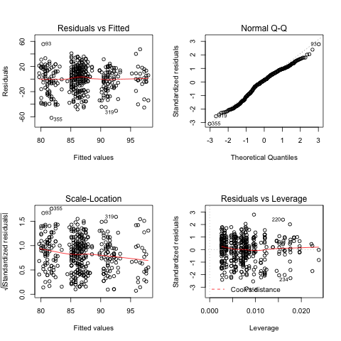
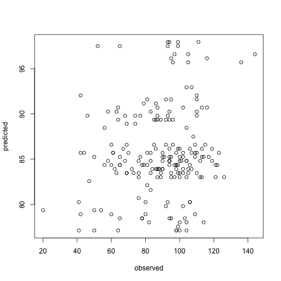
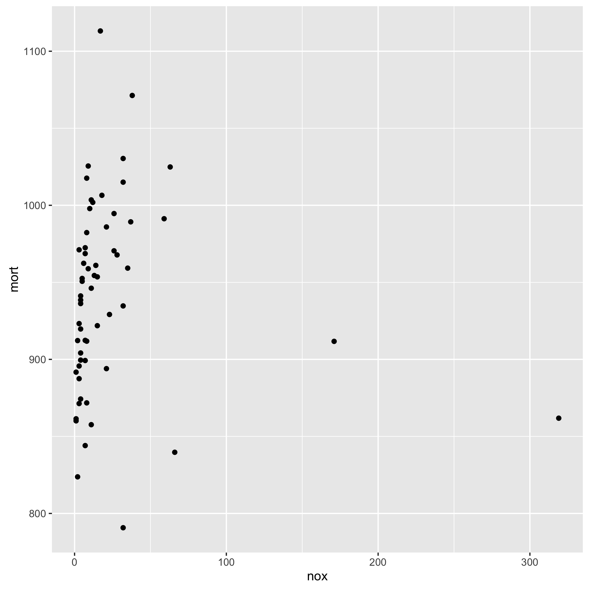
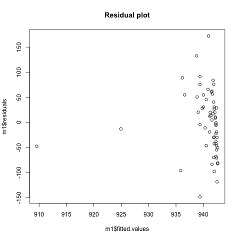
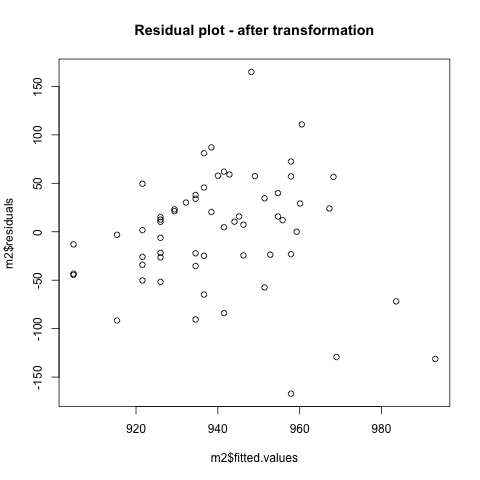
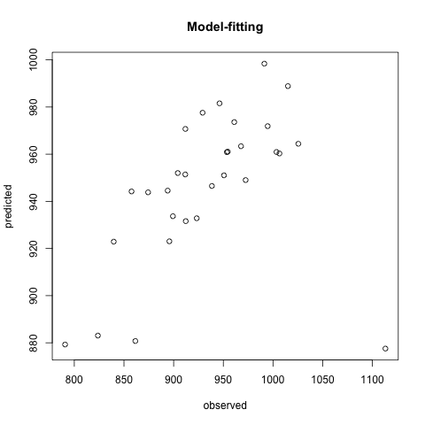

#HW2 - Avinash Ramu

##Question3.4
```R
    library ("foreign")
    iq.data <- read.dta ("dat/child.iq.dta")
    model1 <- lm(ppvt ~ momage, data = iq.data)
    plot(iq.data$momage, iq.data$ppvt)
    lines(iq.data$momage, model1$fitted.values)

    > summary(model1)

    Call:
    lm(formula = ppvt ~ momage, data = iq.data)

    Residuals:
        Min      1Q  Median      3Q     Max
    -67.109 -11.798   2.971  14.860  55.210

    Coefficients:
                Estimate Std. Error t value Pr(>|t|)
    (Intercept)  67.7827     8.6880   7.802 5.42e-14 ***
    momage        0.8403     0.3786   2.219    0.027 *
    ---
    Signif. codes:  0 ‘***’ 0.001 ‘**’ 0.01 ‘*’ 0.05 ‘.’ 0.1 ‘ ’ 1

    Residual standard error: 20.34 on 398 degrees of freedom
    Multiple R-squared:  0.01223,   Adjusted R-squared:  0.009743
    F-statistic: 4.926 on 1 and 398 DF,  p-value: 0.02702
    plot(model1)
```
[](q1_m1.png)
[](q1_model1_all.png)

The coefficient for momage is significant. Based solely on this model alonethe child's score increases with mom's age so I would recommend giving birth later which is late 20's according to this dataset. A years increase in mom's age results in a 0.8403 increase in child score.

The assumptions here include that mom's age is the only relevant predictor of child's score(which might not be true). The errors of the model are independent, have equal variance and are normally distributed. 


####B
```
    model2 <- lm(ppvt ~ momage + educ_cat, data = iq.data)
    plot(model2)
summary(model2)

Call:
lm(formula = ppvt ~ momage + educ_cat, data = iq.data)

Residuals:
    Min      1Q  Median      3Q     Max
-61.763 -13.130   2.495  14.620  55.610

Coefficients:
            Estimate Std. Error t value Pr(>|t|)
(Intercept)  69.1554     8.5706   8.069 8.51e-15 ***
momage        0.3433     0.3981   0.862 0.389003
educ_cat      4.7114     1.3165   3.579 0.000388 ***
---
Signif. codes:  0 ‘***’ 0.001 ‘**’ 0.01 ‘*’ 0.05 ‘.’ 0.1 ‘ ’ 1

Residual standard error: 20.05 on 397 degrees of freedom
Multiple R-squared:  0.04309,   Adjusted R-squared:  0.03827
F-statistic: 8.939 on 2 and 397 DF,  p-value: 0.0001594

```


Mom's age is not significant anymore, mom's educational
category is significant and each increase in category leads to a 4.7 increase in child's score. Mom's age still has a positive coefficient. The R squared increased compared to the previous model which means more variance is being explained by this model. Timing of birth does not seem to be as important as mom's educational category.

####C
```
    iq.data$hs_status <- as.numeric(!(iq.data$educ_cat == 1))
    model3 <- lm(ppvt ~ momage + educ_cat + hs_status:momage, data = iq.data)
summary(model3)

Call:
lm(formula = ppvt ~ momage + educ_cat + hs_status:momage, data = iq.data)

Residuals:
    Min      1Q  Median      3Q     Max
-58.117 -12.748   2.055  14.654  58.158

Coefficients:
                 Estimate Std. Error t value Pr(>|t|)
(Intercept)      74.96262    8.83925   8.481  4.5e-16 ***
momage            0.06897    0.41110   0.168   0.8669
educ_cat          1.56854    1.83048   0.857   0.3920
momage:hs_status  0.38921    0.15855   2.455   0.0145 *
---
Signif. codes:  0 ‘***’ 0.001 ‘**’ 0.01 ‘*’ 0.05 ‘.’ 0.1 ‘ ’ 1

Residual standard error: 19.92 on 396 degrees of freedom
Multiple R-squared:  0.05744,   Adjusted R-squared:  0.0503
F-statistic: 8.044 on 3 and 396 DF,  p-value: 3.247e-05

colors <- ifelse(iq.data$hs_status == 1, "green", "red")
plot(iq$momage, iq$ppvt, ylab="child score", col=colors, pch=15)
curve(cbind(1, 1, x, 1 * x) %*% coef(model3), add=TRUE, col="green") #yes high school
curve(cbind(1, 0, x, 0 * x) %*% coef(model3), add=TRUE, col="red") # no high school
```

The coefficient for the interaction between momage and hs_status is significant. The coefficients for momage and educ_cat alone are not significant any more.

From the regression lines it is seen that for the cases with no high school completion in moms, the rate of increase in the child's test score is smaller with increasing mom's age at birth compared to the moms who have completed high school.

####D

```
 iq.data.first <- iq.data[1:200, ]
 iq.data.second <- iq.data[200:400, ]
 model4 <- lm(ppvt ~ momage + educ_cat, data = iq.data.first)
 second_predicted <- predict(model4, iq.data.second)
 plot(iq.data.second$ppvt, second_predicted, xlab = "observed", ylab = "predicted")
```



The model predicted using the first half of the data seems like a decent fit for the second half of the data. A deeper look at the residuals would help assess the fit.


##Question4.4

```R
     library(foreign)
     p1 <- read.dta("dat/pollution.dta")

```
####A

```R
ggplot(p1) + geom_point(aes(x = nox, y = mort))
ggsave("pollution_scatterplot.png")
m1 <- lm(mort ~ nox, data = p1)a
Call:
lm(formula = mort ~ nox, data = p1)

Residuals:
     Min       1Q   Median       3Q      Max
     -148.654  -43.710    1.751   41.663  172.211

     Coefficients:
                 Estimate Std. Error t value Pr(>|t|)
                 (Intercept) 942.7115     9.0034 104.706   <2e-16 ***
                 nox          -0.1039     0.1758  -0.591    0.557
                 ---
                 Signif. codes:  0 ‘***’ 0.001 ‘**’ 0.01 ‘*’ 0.05 ‘.’ 0.1 ‘ ’ 1

                 Residual standard error: 62.55 on 58 degrees of freedom
                 Multiple R-squared:  0.005987,  Adjusted R-squared:  -0.01115
                 F-statistic: 0.3494 on 1 and 58 DF,  p-value: 0.5568
```




From the scatter plot 'mort' and 'nox' don't follow a simple linear relationship.
Most of the mortality is concentrated on a very small range of nox, some sort of transformation is needed on the predictors.
This is seen in the residual plot as well, there is evidence against linearity.

####B
I decided to use a log transformation on the 'nox' column.
```
p1$lognox <- log10(p1$nox)
m2 <- lm(mort ~ lognox, data = p1)
Call:
lm(formula = mort ~ lognox, data = p1)

Residuals:
     Min       1Q   Median       3Q      Max
     -167.140  -28.368    8.778   35.377  164.983

     Coefficients:
                 Estimate Std. Error t value Pr(>|t|)
                 (Intercept)   904.72      17.17  52.684   <2e-16 ***
                 lognox         35.31      15.19   2.325   0.0236 *
                 ---
                 Signif. codes:  0 ‘***’ 0.001 ‘**’ 0.01 ‘*’ 0.05 ‘.’ 0.1 ‘ ’ 1

                 Residual standard error: 60.01 on 58 degrees of freedom
                 Multiple R-squared:  0.08526,   Adjusted R-squared:  0.06949
                 F-statistic: 5.406 on 1 and 58 DF,  p-value: 0.02359
plot(m2$fitted.values, m2$residuals, main = "Residual plot - after transformation")
ggplot(p1) + geom_point(aes(x = lognox, y = mort)) + ggtitle("scatterplot after tranformation")
```



After transformation, the residual plot and the scatter plot show more evidence for linearity.

####C
The coefficient for nox is significant in this model since it's value within two standard errors is above
zero. A log10 increase in NOX(a factor of ten) increases the mortality by 35.

####D
After looking at scatterplots between the predictors and mort, a model of the form:
mort ~ log10(nox) + log10(so2) + log10(hc) seems appropriate
```
> m2 <- lm(mort ~ lognox + logso2 + loghc, data = p1)
> summary(m2)

Call:
lm(formula = mort ~ lognox + logso2 + loghc, data = p1)

Residuals:
    Min      1Q  Median      3Q     Max
    -97.793 -34.728  -3.118  34.148 194.567

    Coefficients:
                Estimate Std. Error t value Pr(>|t|)
                (Intercept)   924.97      21.45  43.125  < 2e-16 ***
                lognox        134.32      50.08   2.682  0.00960 **
                logso2         27.08      16.50   1.642  0.10629
                loghc        -131.94      44.71  -2.951  0.00462 **
                ---
                Signif. codes:  0 ‘***’ 0.001 ‘**’ 0.01 ‘*’ 0.05 ‘.’ 0.1 ‘ ’ 1

                Residual standard error: 54.36 on 56 degrees of freedom
                Multiple R-squared:  0.2752,    Adjusted R-squared:  0.2363
                F-statistic: 7.086 on 3 and 56 DF,  p-value: 0.0004044
```

Nox and HC are significant, SO2 is not significant. A log10 increase in NOX
results in +134 of mortality. A log10 increase in HC results in a -131 decreasein mortality, the sign of the coefficient does not agree with the scatterplot which indicates an increase in mortality.

####E
```
p1_first30 <- p1[1:30, ]
p1_last30 <- p1[31:60, ]
m3 <- lm(mort ~ lognox + logso2 + loghc, data = p1_first30)
summary(m3)

Call:
lm(formula = mort ~ lognox + logso2 + loghc, data = p1_first30)

Residuals:
     Min       1Q   Median       3Q      Max
     -110.358  -36.766   -1.032   35.049   82.107

     Coefficients:
                 Estimate Std. Error t value Pr(>|t|)
                 (Intercept)   899.97      25.71  35.009   <2e-16 ***
                 lognox         24.33      68.14   0.357   0.7240
                 logso2         50.35      28.38   1.774   0.0877 .
                 loghc         -40.24      60.36  -0.667   0.5108
                 ---
                 Signif. codes:  0 ‘***’ 0.001 ‘**’ 0.01 ‘*’ 0.05 ‘.’ 0.1 ‘ ’ 1

                 Residual standard error: 52.07 on 26 degrees of freedom
                 Multiple R-squared:  0.2522,    Adjusted R-squared:  0.1659
                 F-statistic: 2.922 on 3 and 26 DF,  p-value: 0.05277
plot(p1_last30$mort, predict(m3, p1_last30), xlab = "observed", ylab = "predicted", main = "Model-fitting")
> cor(p1_last30$mort, predict(m3, p1_last30))
[1] 0.4271264
```


Note - the betas are no longer significant when just using half the initial data to fit the model.


##Question5.4

####A
I used the breast cancer data from the UCI machine learning repository. The goal is to predict breast cancer status using a set of features.

The dataset is located here - http://archive.ics.uci.edu/ml/machine-learning-databases/breast-cancer-wisconsin/wdbc.data

The features as described on the site are - 
1) ID number
2) Diagnosis (M = malignant, B = benign)
Ten real-valued features are computed for each cell nucleus:
    a) radius (mean of distances from center to points on the perimeter)
    b) texture (standard deviation of gray-scale values)
    c) perimeter
    d) area
    e) smoothness (local variation in radius lengths)
    f) compactness (perimeter^2 / area - 1.0)
    g) concavity (severity of concave portions of the contour)
    h) concave points (number of concave portions of the contour)
    i) symmetry
    j) fractal dimension ("coastline approximation" - 1)

I chose to use the first five features out of the thirty two features for my model.

```
 bc <- read.table("dat/wdbc.data", sep = ",")
 bc$V2 <- ifelse(bc$V2 == "B", 0, 1) # B is benign, M is malignant
 m1 <- glm(V2 ~ V3 + V4 + V5 + V6 + V7, data=bc, family=binomial(link="logit"))
 m2 <- glm(V2 ~ V3 + V4 , data=bc, family=binomial(link="logit"))
 m3 <- glm(V2 ~ V5 + V6 + V7, data=bc, family=binomial(link="logit"))
 m4 <- glm(V2 ~ V4 + V5 + V6 + V7, data=bc, family=binomial(link="logit"))
```

####B
My model m2 seems to have similar residual deviance compared to the other models. I will be using this for part c

####C

```
summary(m2)

Call:
glm(formula = V2 ~ V3 + V4, family = binomial(link = "logit"),
    data = bc)

Deviance Residuals:
    Min       1Q   Median       3Q      Max
-2.1460  -0.3794  -0.1205   0.1267   2.8449

Coefficients:
             Estimate Std. Error z value Pr(>|z|)
(Intercept) -19.84942    1.77395 -11.189  < 2e-16 ***
V3            1.05710    0.10148  10.417  < 2e-16 ***
V4            0.21814    0.03707   5.885 3.98e-09 ***
    Null deviance: 751.44  on 568  degrees of freedom
Residual deviance: 291.12  on 566  degrees of freedom
AIC: 297.12
```

The outcome is significantly dependent on V3, V4 which are the tumor radius and tumor texture. These make sense
since the malignant tumors are usually larger and have
a distinct texture compared to the benign tumors.

#####1
For each unit increase in the radius the logit probability of being a tumor increases by 1.05 and for each unit increase in the texture of the tumor the logit probability of being a tumor increases by 0.218

#####4
```
test <- data.frame(V3 = c(7, 9, 220), V4 = c(6, 11, 12))

 predict(m2, test, type = "response")
           1            2            3
0.0000145071 0.0003575245 1.0000000000
```
As the tumor size and texture increases the probability of observing a malignant tumor increases.

##Question6.1

```R
    library ("foreign")
    rb <- read.dta ("dat/risky_behaviors.dta")
    m1 <- glm(fupacts ~ women_alone, family="poisson", data = rb
    summary(m1)
    Call:
    glm(formula = fupacts ~ women_alone, family = "poisson", data = rb)

    Deviance Residuals:
    Min      1Q  Median      3Q     Max
    -6.095  -4.976  -3.321   1.261  27.159

    Coefficients:
                Estimate Std. Error z value Pr(>|z|)
    (Intercept)  2.92168    0.01367  213.68   <2e-16 ***
    women_alone -0.40554    0.02721  -14.91   <2e-16 ***
    ---
    Signif. codes:  0 ‘***’ 0.001 ‘**’ 0.01 ‘*’ 0.05 ‘.’ 0.1 ‘ ’ 1

    (Dispersion parameter for poisson family taken to be 1)

        Null deviance: 13307  on 433  degrees of freedom
    Residual deviance: 13070  on 432  degrees of freedom
    AIC: Inf

    Number of Fisher Scoring iterations: 6

```
The residual deviance is huge, the model is a poor fit. women_alone comes out as a significant predictor in this poor model.
```
attach(rb)
yhat <- predict(m1, type = "response")
z <- (fupacts - yhat)/sqrt(yhat)
sum(z^2)/(nrow(rb) - 1)
[1] 43.09338
```

There is definite overdispersion, a factor of 43

####B
```
 m2 <- glm(fupacts ~ women_alone + bs_hiv + bupacts + couples, family="poisson", data = rb)
summary(m2)

Call:
glm(formula = fupacts ~ women_alone + bs_hiv + bupacts + couples,
    family = "poisson", data = rb)

Deviance Residuals:
    Min       1Q   Median       3Q      Max
-19.161   -4.284   -2.526    1.300   23.002

Coefficients:
                 Estimate Std. Error z value Pr(>|z|)
(Intercept)     2.8419972  0.0201435  141.09   <2e-16 ***
women_alone    -0.6577924  0.0308170  -21.34   <2e-16 ***
bs_hivpositive -0.4324392  0.0353714  -12.23   <2e-16 ***
bupacts         0.0107584  0.0001741   61.81   <2e-16 ***
couples        -0.4131564  0.0282688  -14.62   <2e-16 ***
---
Signif. codes:  0 ‘***’ 0.001 ‘**’ 0.01 ‘*’ 0.05 ‘.’ 0.1 ‘ ’ 1

(Dispersion parameter for poisson family taken to be 1)

    Null deviance: 13307  on 433  degrees of freedom
Residual deviance: 10225  on 429  degrees of freedom
AIC: Inf

Number of Fisher Scoring iterations: 6
```
The residual deviance is lower, the model fits better.

```
yhat <- predict(m2, type = "response")
z2 <- (fupacts - yhat)/sqrt(yhat)
sum(z2^2)/(nrow(rb) - 1)
[1] 29.70968
```

Yes there is overdispersion still, a factor of 29.7

####C
```
m3 <- glm(fupacts ~ women_alone + bs_hiv + bupacts + c
ouples, family="quasipoisson", data = rb)
Call:
glm(formula = fupacts ~ women_alone + bs_hiv + bupacts + couples,
    family = "quasipoisson", data = rb)

Deviance Residuals:
    Min       1Q   Median       3Q      Max
-19.161   -4.284   -2.526    1.300   23.002

Coefficients:
                 Estimate Std. Error t value Pr(>|t|)
(Intercept)     2.8419972  0.1103059  25.765  < 2e-16 ***
women_alone    -0.6577924  0.1687544  -3.898 0.000113 ***
bs_hivpositive -0.4324392  0.1936943  -2.233 0.026092 *
bupacts         0.0107584  0.0009531  11.288  < 2e-16 ***
couples        -0.4131564  0.1548001  -2.669 0.007897 **
---
Signif. codes:  0 ‘***’ 0.001 ‘**’ 0.01 ‘*’ 0.05 ‘.’ 0.1 ‘ ’ 1

(Dispersion parameter for quasipoisson family taken to be 29.98672)

    Null deviance: 13307  on 433  degrees of freedom
Residual deviance: 10225  on 429  degrees of freedom
AIC: NA

Number of Fisher Scoring iterations: 6
```

Both the coefficients for 'couples' and 'women_alone' are significant. The coefficient 'women_alone' has a slightly higher effect on reducing the outcome variable. 

####D
Yes the responses from both men and women could be a problem if there is some sort of bias in the responses that aggregates by sex. There might also be cases where the answers of the couple might contradict each other.
