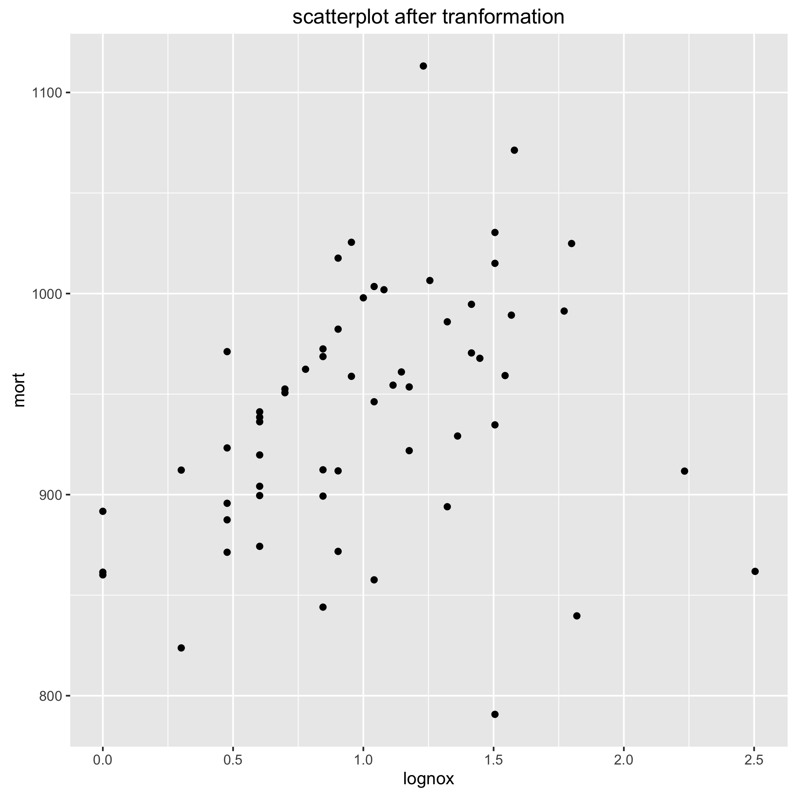

#HW2 - Avinash Ramu

##Question3.4
```R
    library ("foreign")
    iq.data <- read.dta ("child.iq/child.iq.dta")
    model1 <- lm(ppvt ~ momage, data = iq.data)
plot(iq.data$momage, iq.data$ppvt)
lines(iq.data$momage, model1$fitted.values)

> summary(model1)

Call:
lm(formula = ppvt ~ momage, data = iq.data)

Residuals:
    Min      1Q  Median      3Q     Max
-67.109 -11.798   2.971  14.860  55.210

Coefficients:
            Estimate Std. Error t value Pr(>|t|)
(Intercept)  67.7827     8.6880   7.802 5.42e-14 ***
momage        0.8403     0.3786   2.219    0.027 *
---
Signif. codes:  0 ‘***’ 0.001 ‘**’ 0.01 ‘*’ 0.05 ‘.’ 0.1 ‘ ’ 1

Residual standard error: 20.34 on 398 degrees of freedom
Multiple R-squared:  0.01223,   Adjusted R-squared:  0.009743
F-statistic: 4.926 on 1 and 398 DF,  p-value: 0.02702


iq.data$hs_status <- as.numeric(!(iq.data$educ_cat == 1))
```

##Question4.4

```R
     library(foreign)
     p1 <- read.dta("dat/pollution.dta")

```
####A

```R
ggplot(p1) + geom_point(aes(x = nox, y = mort))
ggsave("pollution_scatterplot.png")
m1 <- lm(mort ~ nox, data = p1)a
Call:
lm(formula = mort ~ nox, data = p1)

Residuals:
     Min       1Q   Median       3Q      Max
     -148.654  -43.710    1.751   41.663  172.211

     Coefficients:
                 Estimate Std. Error t value Pr(>|t|)
                 (Intercept) 942.7115     9.0034 104.706   <2e-16 ***
                 nox          -0.1039     0.1758  -0.591    0.557
                 ---
                 Signif. codes:  0 ‘***’ 0.001 ‘**’ 0.01 ‘*’ 0.05 ‘.’ 0.1 ‘ ’ 1

                 Residual standard error: 62.55 on 58 degrees of freedom
                 Multiple R-squared:  0.005987,  Adjusted R-squared:  -0.01115
                 F-statistic: 0.3494 on 1 and 58 DF,  p-value: 0.5568
```


From the scatter plot 'mort' and 'nox' don't follow a simple linear relationship.
Most of the mortality is concentrated on a very small range of nox, some sort of transformation is needed on the predictors.
This is seen in the residual plot as well, there is evidence against linearity.

####B
I decided to use a log transformation on the 'nox' column.
```
p1$lognox <- log10(p1$nox)
m2 <- lm(mort ~ lognox, data = p1)
Call:
lm(formula = mort ~ lognox, data = p1)

Residuals:
     Min       1Q   Median       3Q      Max
     -167.140  -28.368    8.778   35.377  164.983

     Coefficients:
                 Estimate Std. Error t value Pr(>|t|)
                 (Intercept)   904.72      17.17  52.684   <2e-16 ***
                 lognox         35.31      15.19   2.325   0.0236 *
                 ---
                 Signif. codes:  0 ‘***’ 0.001 ‘**’ 0.01 ‘*’ 0.05 ‘.’ 0.1 ‘ ’ 1

                 Residual standard error: 60.01 on 58 degrees of freedom
                 Multiple R-squared:  0.08526,   Adjusted R-squared:  0.06949
                 F-statistic: 5.406 on 1 and 58 DF,  p-value: 0.02359
plot(m2$fitted.values, m2$residuals, main = "Residual plot - after transformation")
ggplot(p1) + geom_point(aes(x = lognox, y = mort)) + ggtitle("scatterplot after tranformation")
```



After transformation, the residual plot and the scatter plot show more evidence for linearity.

####C
The coefficient for nox is significant in this model since it's value within two standard errors is above
zero. A log10 increase in NOX(a factor of ten) increases the mortality by 35.

####D
After looking at scatterplots between the predictors and mort, a model of the form:
mort ~ log10(nox) + log10(so2) + log10(hc) seems appropriate
```
> m2 <- lm(mort ~ lognox + logso2 + loghc, data = p1)
> summary(m2)

Call:
lm(formula = mort ~ lognox + logso2 + loghc, data = p1)

Residuals:
    Min      1Q  Median      3Q     Max
    -97.793 -34.728  -3.118  34.148 194.567

    Coefficients:
                Estimate Std. Error t value Pr(>|t|)
                (Intercept)   924.97      21.45  43.125  < 2e-16 ***
                lognox        134.32      50.08   2.682  0.00960 **
                logso2         27.08      16.50   1.642  0.10629
                loghc        -131.94      44.71  -2.951  0.00462 **
                ---
                Signif. codes:  0 ‘***’ 0.001 ‘**’ 0.01 ‘*’ 0.05 ‘.’ 0.1 ‘ ’ 1

                Residual standard error: 54.36 on 56 degrees of freedom
                Multiple R-squared:  0.2752,    Adjusted R-squared:  0.2363
                F-statistic: 7.086 on 3 and 56 DF,  p-value: 0.0004044
```

Nox and HC are significant, SO2 is not significant. A log10 increase in NOX
results in +134 of mortality. A log10 increase in HC results in a -131 decreasein mortality, the sign of the coefficient does not agree with the scatterplot which indicates an increase in mortality.

####E
```
p1_first30 <- p1[1:30, ]
p1_last30 <- p1[31:60, ]
m3 <- lm(mort ~ lognox + logso2 + loghc, data = p1_first30)
summary(m3)

Call:
lm(formula = mort ~ lognox + logso2 + loghc, data = p1_first30)

Residuals:
     Min       1Q   Median       3Q      Max
     -110.358  -36.766   -1.032   35.049   82.107

     Coefficients:
                 Estimate Std. Error t value Pr(>|t|)
                 (Intercept)   899.97      25.71  35.009   <2e-16 ***
                 lognox         24.33      68.14   0.357   0.7240
                 logso2         50.35      28.38   1.774   0.0877 .
                 loghc         -40.24      60.36  -0.667   0.5108
                 ---
                 Signif. codes:  0 ‘***’ 0.001 ‘**’ 0.01 ‘*’ 0.05 ‘.’ 0.1 ‘ ’ 1

                 Residual standard error: 52.07 on 26 degrees of freedom
                 Multiple R-squared:  0.2522,    Adjusted R-squared:  0.1659
                 F-statistic: 2.922 on 3 and 26 DF,  p-value: 0.05277
plot(p1_last30$mort, predict(m3, p1_last30), xlab = "observed", ylab = "predicted", main = "Model-fitting")
> cor(p1_last30$mort, predict(m3, p1_last30))
[1] 0.4271264
```


Note - the betas are no longer significant when just using half the initial data to fit the model.


##Question6.1

```R
    library ("foreign")
    rb <- read.dta ("dat/risky_behaviors.dta")
    m1 <- glm(fupacts ~ women_alone, family="poisson", data = rb
    summary(m1)
    Call:
    glm(formula = fupacts ~ women_alone, family = "poisson", data = rb)

    Deviance Residuals:
    Min      1Q  Median      3Q     Max
    -6.095  -4.976  -3.321   1.261  27.159

    Coefficients:
                Estimate Std. Error z value Pr(>|z|)
    (Intercept)  2.92168    0.01367  213.68   <2e-16 ***
    women_alone -0.40554    0.02721  -14.91   <2e-16 ***
    ---
    Signif. codes:  0 ‘***’ 0.001 ‘**’ 0.01 ‘*’ 0.05 ‘.’ 0.1 ‘ ’ 1

    (Dispersion parameter for poisson family taken to be 1)

        Null deviance: 13307  on 433  degrees of freedom
    Residual deviance: 13070  on 432  degrees of freedom
    AIC: Inf

    Number of Fisher Scoring iterations: 6

```
The residual deviance is huge, the model is a poor fit. women_alone comes out as a significant predictor in this poor model.
```
attach(rb)
yhat <- predict(m1, type = "response")
z <- (fupacts - yhat)/sqrt(yhat)
sum(z^2)/(nrow(rb) - 1)
[1] 43.09338
```

There is definite overdispersion, a factor of 43

####B
```
 m2 <- glm(fupacts ~ women_alone + bs_hiv + bupacts + couples, family="poisson", data = rb)
summary(m2)

Call:
glm(formula = fupacts ~ women_alone + bs_hiv + bupacts + couples,
    family = "poisson", data = rb)

Deviance Residuals:
    Min       1Q   Median       3Q      Max
-19.161   -4.284   -2.526    1.300   23.002

Coefficients:
                 Estimate Std. Error z value Pr(>|z|)
(Intercept)     2.8419972  0.0201435  141.09   <2e-16 ***
women_alone    -0.6577924  0.0308170  -21.34   <2e-16 ***
bs_hivpositive -0.4324392  0.0353714  -12.23   <2e-16 ***
bupacts         0.0107584  0.0001741   61.81   <2e-16 ***
couples        -0.4131564  0.0282688  -14.62   <2e-16 ***
---
Signif. codes:  0 ‘***’ 0.001 ‘**’ 0.01 ‘*’ 0.05 ‘.’ 0.1 ‘ ’ 1

(Dispersion parameter for poisson family taken to be 1)

    Null deviance: 13307  on 433  degrees of freedom
Residual deviance: 10225  on 429  degrees of freedom
AIC: Inf

Number of Fisher Scoring iterations: 6
```
The residual deviance is lower, the model fits better.

```
yhat <- predict(m2, type = "response")
z2 <- (fupacts - yhat)/sqrt(yhat)
sum(z2^2)/(nrow(rb) - 1)
[1] 29.70968
```

Yes there is overdispersion still, a factor of 29.7

####C
```
m3 <- glm(fupacts ~ women_alone + bs_hiv + bupacts + c
ouples, family="quasipoisson", data = rb)
Call:
glm(formula = fupacts ~ women_alone + bs_hiv + bupacts + couples,
    family = "quasipoisson", data = rb)

Deviance Residuals:
    Min       1Q   Median       3Q      Max
-19.161   -4.284   -2.526    1.300   23.002

Coefficients:
                 Estimate Std. Error t value Pr(>|t|)
(Intercept)     2.8419972  0.1103059  25.765  < 2e-16 ***
women_alone    -0.6577924  0.1687544  -3.898 0.000113 ***
bs_hivpositive -0.4324392  0.1936943  -2.233 0.026092 *
bupacts         0.0107584  0.0009531  11.288  < 2e-16 ***
couples        -0.4131564  0.1548001  -2.669 0.007897 **
---
Signif. codes:  0 ‘***’ 0.001 ‘**’ 0.01 ‘*’ 0.05 ‘.’ 0.1 ‘ ’ 1

(Dispersion parameter for quasipoisson family taken to be 29.98672)

    Null deviance: 13307  on 433  degrees of freedom
Residual deviance: 10225  on 429  degrees of freedom
AIC: NA

Number of Fisher Scoring iterations: 6
```

Both the coefficients for 'couples' and 'women_alone' are significant. The coefficient 'women_alone' has a slightly higher effect on reducing the outcome variable. 

####D
Yes the responses from both men and women could be a problem if there is some sort of bias in the responses that aggregates by sex. There might also be cases where the answers of the couple might contradict each other.
