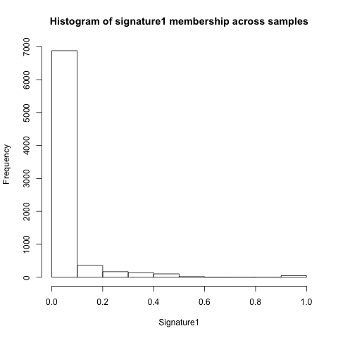
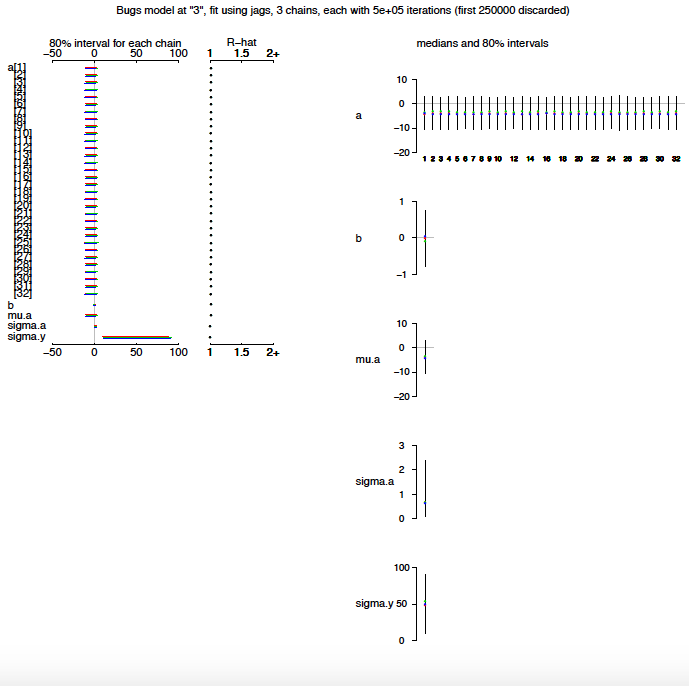

```{r setup, include=FALSE}
knitr::opts_chunk$set(echo = TRUE)
```

# Identifying drivers of mutational signatures using a Bayesian hierarchical model

## Introduction

## Data


## Methods
```r
    for (i in 1:n){
        y[i] ~ dbeta (alpha[i], beta[i])
        alpha[i] <- mu[i] * phi
        beta[i] <- (1 - mu[i]) * phi
        logit(mu[i]) <- a[tissue[i]] + b*x[i]
    }
    b ~ dnorm(0, 0.0001)
    tau.y <- pow(sigma.y, -2)
    sigma.y ~ dunif (0, 100)
    for (j in 1:J){
        a[j] ~ dnorm (mu.a, tau.a)
    }
    mu.a ~ dnorm (0, .0001)
    tau.a <- pow(sigma.a, -2)
    sigma.a ~ dunif (0, 100)
    phi ~ dgamma(0.1, 0.1)
```

## Results

